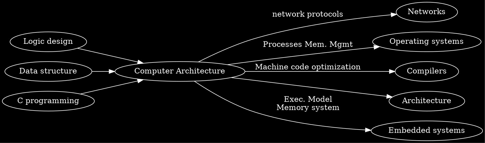

```noteinfo
{
	"date": {
		"y": 23,
		"m": 2,
		"d": 2017
	},
	"tag": ["course", "CS"]
}
```

## Computer Architecture

[toc]

### Introduction

Goals:
- become more efficient while programming
- prepare for other courses (Compilers, Operating Systems, Networks, Computer Architecture, Embedded Systems)

Reality:
- int's are not intergers and float's are not reals
	- example: memory copy
- assembly related (not understand at 1st week)
- memory matters
	- bounded
	- bugs pernicious, distant in both time and space
	- performance not uniform: cache, virtual memory can have great effect, can leed to major speed improvements
- constant factor matters
	- exact op numbers still does not predict performance
	- must understand system to optimize performance
		- how program compile, execute
		- how to measure and improve performance. example: matrix-matrix multiplication
- computers do more than executing programs
	- I/O
	- communicate via network, concurrency, compatibility, complex performance issues

Course perspective:



#### Programs and Data

Topics:
- Bits operations, arithmetic, assembly language programs
- Representation of C control and data structures
- Includes aspects of architecture and compilers 


Assignments:
- L1 (datalab): Manipulating bits
- L2 (bomblab): Defusing a binary bomb
- L3 (attacklab): The basics of code injection attacks

#### The Memory Hierarchy
Topics
- Memory technology, memory hierarchy, caches, disks, locality
- Includes aspects of architecture and OS

Assignments
- L4 (cachelab): Building a cache simulator and optimizing for locality.
	- Learn how to exploit locality in your programs. 

#### Exceptional  Control Flow

Topics
- Hardware exceptions, processes, process control, Unix signals, nonlocal jumps
- Includes aspects of compilers, OS, and architecture

Assignments
- L5 (tshlab): Writing your own Unix shell.
	- A first introduction to concurrency

####  Virtual Memory
Topics
- Virtual memory, address translation, dynamic storage allocation
- Includes aspects of architecture and OS

Assignments
- L6 (malloclab): Writing your own malloc package
	- Get a real feel for systems-level programming


####  Networking, and Concurrency

Topics
- High level and low-level I/O, network programming
- Internet services, Web servers
- concurrency, concurrent server design, threads
- I/O multiplexing with select
- Includes aspects of networking, OS, and architecture

Assignments
- L7 (proxylab): Writing your own Web proxy
	- Learn network programming and more about concurrency and synchronization. 


#### Grading

Exams (45%)
- Midterm exams (15%)
- Final exams(30%)
- All exams are open book/open notes.
Labs (55%)
- 7 labs (each )
- Late submission of lab will be punished
- 10% per week 

#### Teaching stuff
find it in class01.ppt

### Bits and Bytes

Why bits
- store
- transmit
- easy to implement logical functions

To handle huge amount of bits
- group into larger units to manage
- use address to identify bits

Byte Oriented Memory Organization
- program refer to virtual memory
- Compiler + Run-Time System Control Allocation
- Byte = 8 bits

Machine word
- Most machines are 32-64 bits (4 bytes-8bytes)
	- 32 bits: limit address to 4GB
	- 64 bits: $\approx 1.8\times 10^{19}$bytes (virtual address)
- always integral number of bytes

#### Representing information as bits

Data representations

|C data type|Typical 32-bit|Intel IA32| x86-64|
|:--|:--:|:--:|:--:|
|char|1|1|1|
|short|2|2|2|
|int|4|4|4|
|long|4|4|8|
|long long|8|8|8|
|float|4|4|4|
|double|8|8|8|
|long double|8|10/12|10/16|
|pointer|4|4|8|


Detect your system
```c
int main()
{
	printf( "%d\n", sizeof( void*) );
}
```

Byte Odering
- big-endian: Least significant byte has highest address
- little-endian: Least significant byte has lowest address

Disassembly
- Text representation of binary machine code
- Generated by program that reads the machine code

Code to Print Byte Representation of Data

```c
typedef unsigned char *pointer;

void show_bytes(pointer start, int len)
{
  int i;
  for (i = 0; i < len; i++)
    printf("0x%p\t0x%.2x\n",
           start+i, start[i]);
  printf("\n");
}

```

Different compilers & machines assign different locations to objects

resenting:
- Integers
- Pointers
- Floats: Not same as integer representation, but consistent across machines
- Strings: Text files generally platform independent. Except for different conventions of line termination character(s)!


Machine-Level Code Representation

- Encode Program as Sequence of Instructions
	- Each simple operation: Arithmetic operation, Read or write memory,Conditional branch
	- Instructions encoded as bytes
		- Sun’s, PPC Mac’s use 4 byte instructions
			- Reduced Instruction Set Computer (RISC)
		- PC’s use variable length instructions
			- Complex Instruction Set Computer (CISC)
	- Different instruction types and encodings for different machines
		- Most code not binary compatible
- Programs are Byte Sequences Too!

Representing Instructions
- Different machines use totally different instructions and encodings

#### Bit-level manipulations


Boolean algebra
- Applied to Digital Systems by Claude Shannon
- Relations Between Operations
- General Boolean Algebras
- Representing & Manipulating Sets
- Bit-Level Operations in C
	- Apply to any “integral” data type
	- View arguments as bit vectors
- Contrast: Logic Operations in C
- Shift Operations
- Cool Stuff with Xor

```c
// exchange values of *x and *y
void funny(int *x, int *y)
{
   *x = *x ^ *y;    /* #1 */
   *y = *x ^ *y;    /* #2 */
   *x = *x ^ *y;    /* #3 */
}

```

#### Main points

It’s All About Bits & Bytes
- Numbers
- Programs
- Text

Different Machines Follow Different Conventions
- Word size
- Byte ordering
- Representations

Boolean Algebra is Mathematical Basis
- Basic form encodes “false” as 0, “true” as 1
- General form like bit-level operations in C
	- Good for representing & manipulating sets


