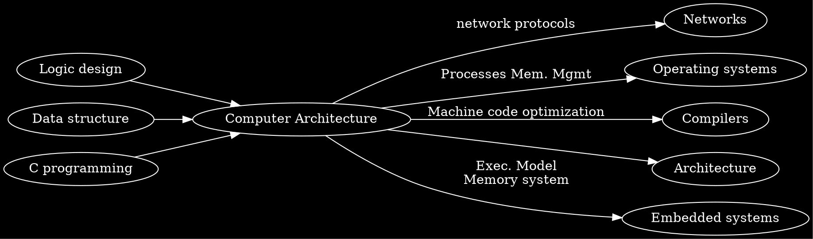

```noteinfo
{
	"date": {
		"y": 23,
		"m": 2,
		"d": 2017
	},
	"tag": ["course", "CS"]
}
```

## Computer Architecture

[toc]

### Introduction

Goals:
- become more efficient while programming
- prepare for other courses (Compilers, Operating Systems, Networks, Computer Architecture, Embedded Systems)

Reality:
- int's are not intergers and float's are not reals
	- example: memory copy
- assembly related (not understand at 1st week)
- memory matters
	- bounded
	- bugs pernicious, distant in both time and space
	- performance not uniform: cache, virtual memory can have great effect, can leed to major speed improvements
- constant factor matters
	- exact op numbers still does not predict performance
	- must understand system to optimize performance
		- how program compile, execute
		- how to measure and improve performance. example: matrix-matrix multiplication
- computers do more than executing programs
	- I/O
	- communicate via network, concurrency, compatibility, complex performance issues

Course perspective:



#### Programs and Data

Topics:
- Bits operations, arithmetic, assembly language programs
- Representation of C control and data structures
- Includes aspects of architecture and compilers 


Assignments:
- L1 (datalab): Manipulating bits
- L2 (bomblab): Defusing a binary bomb
- L3 (attacklab): The basics of code injection attacks

#### The Memory Hierarchy
Topics
- Memory technology, memory hierarchy, caches, disks, locality
- Includes aspects of architecture and OS

Assignments
- L4 (cachelab): Building a cache simulator and optimizing for locality.
	- Learn how to exploit locality in your programs. 

#### Exceptional  Control Flow

Topics
- Hardware exceptions, processes, process control, Unix signals, nonlocal jumps
- Includes aspects of compilers, OS, and architecture

Assignments
- L5 (tshlab): Writing your own Unix shell.
	- A first introduction to concurrency

####  Virtual Memory
Topics
- Virtual memory, address translation, dynamic storage allocation
- Includes aspects of architecture and OS

Assignments
- L6 (malloclab): Writing your own malloc package
	- Get a real feel for systems-level programming


####  Networking, and Concurrency

Topics
- High level and low-level I/O, network programming
- Internet services, Web servers
- concurrency, concurrent server design, threads
- I/O multiplexing with select
- Includes aspects of networking, OS, and architecture

Assignments
- L7 (proxylab): Writing your own Web proxy
	- Learn network programming and more about concurrency and synchronization. 


#### Grading

Exams (45%)
- Midterm exams (15%)
- Final exams(30%)
- All exams are open book/open notes.
Labs (55%)
- 7 labs (each )
- Late submission of lab will be punished
- 10% per week 

#### Teaching stuff
find it in class01.ppt

