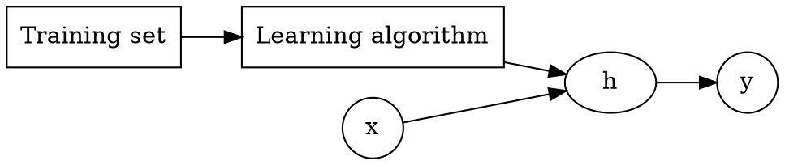
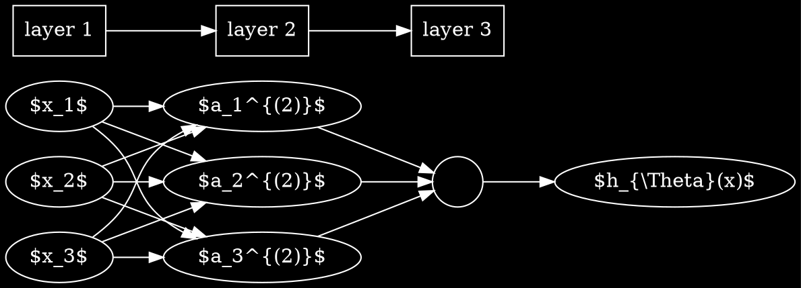
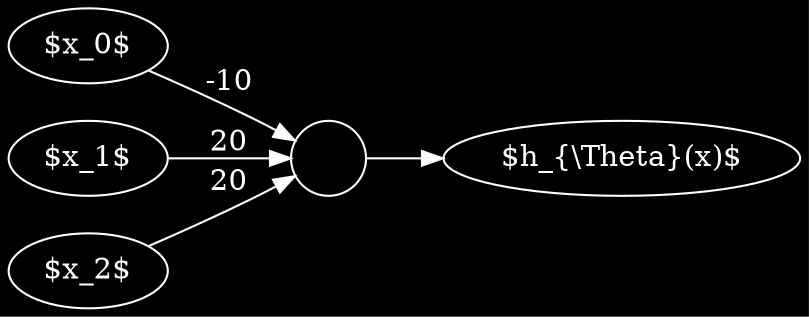

```noteinfo
{
	"date": {
		"y": 2017,
		"m": 1,
		"d": 30
	},
	"tag": ["study", "other", "CS"]
}
```

# Machine Learning

From [coursera](https://www.coursera.org/learn/machine-learning)


Started on Jan 29, 2017.


[toc]

## Intro

[toc]

### Examples:
- Database mining
- Application can't program by hand
	- autonomous helicopter, handwriting recognition, most natural language processing, computer vision
- Self-customizing programs


### Supervised learning

Concepts:
- Feature/Attribute

Two types of problem:
- Classification
- Regression




### Unsupervised learning

Not told the structure/feature/type. Automatically find the structure/pattern

E.g., clustering algorithm

Application:
- organize computer cluster
- social network analysis
- market segmentation
- astronomical data analysis

Cocktail party problem: two sound source, two microphone with different distances to the sound source, separate the two sound.

Quiz finished at 22:00, Jan 30, 2017.

## Model and Cost Function

Training set, notations: $m, x, y$

Hypothesis, Parameters, Cost function

Gradient descent

$\alpha$ is called the learning rate

## Linear Regression with Multiple Variables

[toc]

### Multiple features

### Gradient descent for multi var

$$
\theta_j := \theta_j - \alpha \frac{1}{m}\sum_{i=1}^{m}(h_{\theta}(x^{(i)})-y^{(i)})x_j^{(i)}
$$


### Feature scaling

Feature scaling: Get every feature into approximately a $-1\le x_i\le 1$ range.

For cost functions having squeezed oval contours, gradient descent might go back and forth many times until convergence. Hence it's useful to rescale the features.

Mean normalization: Replace $x_i$ with $ x_i - \mu_i$ to make features have approximately zero means (do not apply to $x_0 = 1$).


$\require{AMSsymbols}\therefore x_i := \frac{x_i- \mu_i }{S_i} $ where $S_i$ is the range and $ \mu_i $ is the mean value


### Learning rate

Too big: $J$ goes up vs number of iterations

Too small: converge too slow

$\therefore$ try the largest $\alpha$ then use value a little bit smaller than that

### Polynomial regression

- combine features
- change the behavior or curve of the hypothesis function to quadratic, cubic, square root, etc.

### Normal Equation

Normal equation formula:

$$
\theta = (X^T X)^{-1} X^Ty
$$

- no need to choose $\alpha$
- no need to iterate
- need to compute $(X^T X)^{-1} $, which is $O(n^3)$. Gradient descent: $O(n^2)$
- slow if $n$ is very large

Common causes of noninvertibility:
- redundant features, where two features are nearly linearly dependent
- too many features (e.g., $m\le n $)

## Classification and representation

Binary classification problem

0 is also called the negative class, and 1 the positive class, and they are sometimes also denoted by the symbols “-” and “+.”

Sigmoid/Logistic function:
$$
g(z) = \frac{1}{1+e^{-z}}
$$

$ h_{\theta}(x)= g(\theta^{T}x)=$ estimation probability that $y=1$ on input $x$ (linear regression).


Decision Boundary

Cost function: because $h_{\theta} $ is now nonlinear, a new convex cost function is needed instead of square sum. $\therefore$ Logistic regression cost function: (for single case)
$$
\mathrm{Cost}(h_{\theta}(x),y)=
\left\lbrace
\begin{array}{rl}
-\log (h_{\theta}(x)) & y=1\cr
-\log (1-h_{\theta}(x)) & y=0
\end{array} 
\right. = - y \log (h_{\theta}(x)) - (1-y) \log (1-h_{\theta}(x))
$$
$$
\therefore J(\theta) = \frac{1}{m} \sum_{i=1}^{m}\mathrm{Cost}(h_{\theta}(x^{(i)},y^{(i)})) = - \frac{1}{m} \sum_{i=1}^m [ y^{(i)} \log (h_{\theta}(x^{(i)})) + (1-y^{(i)}) \log (1-h_{\theta}(x^{(i)})) ]
$$

Gradient descent: $ \theta := \theta -\frac{\alpha}{m}X^T (g(X^T \theta)-\vec y) $

Optimization algorithm:
- Gradient descent
- Conjugate gradient
- BFGS
- L-BFGS

They are usually implemented and included in libraries, use them.

### Multiclass classification: one vs all
<p>
Train a logistic regression classifier $ h_{\theta}^{(i)} (x) $ for each class $i$ to predict the probability that $ y=i $.
On new input $x$, choose class $i$ that maximize $ \mathrm{max}_i h_{\theta}^{(i)} (x)  $.	
</p>

E.g., fit three classifiers for three subclass.


### Overfitting


- underfit, high bias
- just right
- overfit, high variance

too many features, fit the training set too well, fail to generalize to new examples

Addressing overfiting:
1. Reduce number of features
	- Manually select features to keep
	- Model selection algorithm
2. Regularization
	- Keep all features, but reduce magnitude/values of $ \theta_j$
	- works well when we have a lot of features, each of which contributes a bit to the prediction

#### Regularization

Small values for parameters

$$
J(\theta) = \frac{1}{2m} \left [\sum^m_{i=1} ( h_{\theta}(x^{(i)}) - y^{(i)} )^2 + \lambda \sum^n_{j=1} \theta_j^2 \right ]
$$

$\therefore$ effectively keeping the fit model simple (the more $\theta_j \approx 0$, the smaller $J(\theta)$ is)

Gradient descent (regularized):

$$
\displaystyle \theta_j := \theta_j(1-\alpha\frac{\lambda}{m}) - \alpha\frac{1}{m}\sum_{i=1}^m(h_\theta(x^{(i)})-y^{(i)})x^{(i)}_j
$$

Normal equation (for linear regression):

$$
\theta = \left(X^T X +\lambda \left [\begin{array}{cccc}
0&&&\cr
&1&&\cr
&&1&\cr
&&&\ddots
\end{array} \right ] \right)^{-1} X^Ty
$$
which can also fix non-invertibility of $X^TX$ for $ m \le n $.


Regularized gradient descent for Logistic regression:
- almost the same as before
- the same extra term as in linear regularized gradient descent

<!-- ## Test Graphviz

Test LaTeX

```dot-parse
digraph G {

	graph [
	rankdir = "LR";
	bgcolor="black";
	];
	edge[color="white";fontcolor="white";];
	node[color="white";fontcolor="white";];

	h[label="$\\theta$";shape=rectangle;];
	h1[label="$\\frac{\\partial}{\\partial \\alpha}$";shape=circle;];
	h2[label="$\\int_{\\Omega} d \\omega = \\int_{\\partial \\Omega} \\omega$";shape=rectangle;];
	h1->h2[label="$\\sum_n^{\\infty} \\frac{1}{n^2}$";];
	h->h2[label="$e^{i\\theta}$"]
	a[URL="#intro";];
	a->{b->c}
}
``` -->

## Neural networks

Motivations
- nonlinear features/hypothesis
- too many features

Background
- origin: algorithms try to mimic the brain
- state-of-the-art approach for many application
- "one learning algorithm" hypothesis: auditory cortex can learn to see from neural re-wire experiment


### Model representation

Model a neuron as a logistic unit
```dot-parse
digraph G {
	graph[rankdir="LR";
		bgcolor="black";];

	edge[color="white";fontcolor="white";];
	node[color="white";fontcolor="white";];

	a[label="";shape=circle];
	"$x_1$"->a;
	"$x_2$"->a;
	"$x_3$"->a;
	a->"$h_{\\theta}(x)$";
}
```

$x_0$: bias unit, always equals to 1, might not draw it

$\theta$: sometimes called parameters or `weights`

Neural network is just a group of neutons strong together:



Layer 1 is also called the `input layer`. Final layer: `output layer`. Layer between (anything else): `hidden layer`.
- $ a_i^{(j)} $: "acvitation" of unit $i$ in layer $j$
- $ \Theta^{(j)} $: matrix of weights controlling function mapping from layer $j$ to layer $j+1$
<p>
$$
 a^{(j+1)}_m =  g(\Theta^{(j)}_{mn} a^{(j)}_n )= g(z^{(j)} )$$
</p>

This is also called `forward propagation`.

The hidden layer is effectively learning its own features and finally do logistic regression.

The structure how the neural network is connected is called `architectures`.

If numbers are drawn on the arrows, it's the corresponded $\Theta$ value.

Easiest example: single layer neural network which simulate logic OR operation:



Other logic operations can be constructed similarly.

### Multi class classification

Just modify the output layer to have more nodes. i.e., increase the dimension of $y$.


## Cost func and backpropagation

cost function

<p>
$$
	J(\Theta)  = - \frac{1}{m} \left [ \sum^m_{i=1} \sum^K_{k=1} y_k^{(i)} \log ( h_{\Theta}(x^{(i)}) )_k + (1-y_k^{(i)} ) \log ( 1- (h_{\Theta}(x^{(i)}))_k  )   \right ]+\frac{\lambda}{2m} \sum^{L-1}_{l=1}\sum^{s_l}_{i=1}\sum^{s_{l +1}}_{j=1} \left (\Theta^{(l)}_{ji}  \right )^2
$$	
</p>

Back propagation
- Trainning set $ \lbrace (x^{(1)}, y^{(1)}) \cdots (x^{(m)}, y^{(m)})\rbrace $
- Set $\Delta^{(l)}_{i,j} = 0$ for all $(i,j,l)$
- For training examples 1 to m:
	- Set $a^{(1)} := x^{(t)}$
	- Perform forward propagation to compute $ a^{(l)} $ for l = 2, 3, ..., L
	- Using $ y^{(i)} $, compute $\delta^{(L)} = a^{(L)} - y^{(t)}$
	- <p>compute $ \delta^{(L-1)}, \delta^{(L-2)},\dots,\delta^{(2)}$ using $ \delta^{(l)} = ((\Theta^{(l)})^T \delta^{(l+1)}).\*a^{(l)}.\*(1 - a^{(l)})$</p>
	- $\Delta^{(l)}\_{i,j} := \Delta^{(l)}\_{i,j} + a_j^{(l)} \delta_i^{(l+1)}$ or $ \Delta^{(l)} := \Delta^{(l)} + \delta^{(l+1)}(a^{(l)})^T $
- $D^{(l)}\_{i,j} := \dfrac{1}{m}\left(\Delta^{(l)}\_{i,j} + \lambda\Theta^{(l)}\_{i,j}\right)$ if $ j \neq 0 $
- $ D^{(l)}\_{i,j} := \dfrac{1}{m}\Delta^{(l)}\_{i,j} $ if$j=0$


### Backprop in practice

- unrolling parameters:
```cpp
thetaVec = [ Theta1(:); Theta2(:); Theta3(:)];
DVec = [D1(:); D2(:); D3(:)];

Theta1 = reshape(thetaVec(1:110),10,11);
Theta2 = reshape(thetaVec(111:220),10,11);
Theta3 = reshape(thetaVec(221:231),1,11);
```

- Use gradient check to prevent bugs in backprop, turn it off for training
- random initialization: symmetry breaking
- training a neural network
	- architecture: \# of input unit: dimension of $x$, \# of output unit: number of classes. Reasonable default: 1 hidden layer
	- randomly initialize
	- implement foward propagate
	- implement code to compute $J(\Theta)$
	- implement backprop to compute partial derivatives
	- use gradient check to compare partial derivatives, then disable gradient check
	- use gradient descent or advanced optimization method with backprop to minimize $J(\Theta)$
- good strategy for choosing $\epsilon_{init} = \sqrt 6 / ( \sqrt{ L_{in}+L_{out} } )$

