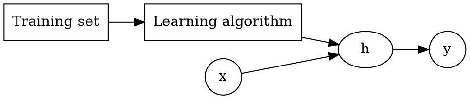

# Machine Learning

From [coursera](https://www.coursera.org/learn/machine-learning)


Started on Jan 29, 2017.
```noteinfo
{
	"date": {
		"y": 2017,
		"m": 1,
		"d": 30
	},
	"tag": ["study", "other"]
}
```

[toc]

## Intro

[toc]

### Examples:
- Database mining
- Application can't program by hand
	- autonomous helicopter, handwriting recognition, most natural language processing, computer vision
- Self-customizing programs


### Supervised learning

Concepts:
- Feature/Attribute

Two types of problem:
- Classification
- Regression




### Unsupervised learning

Not told the structure/feature/type. Automatically find the structure/pattern

E.g., clustering algorithm

Application:
- organize computer cluster
- social network analysis
- market segmentation
- astronomical data analysis

Cocktail party problem: two sound source, two microphone with different distances to the sound source, separate the two sound.

Quiz finished at 22:00, Jan 30, 2017.

## Model and Cost Function

Training set, notations: $m, x, y$

Hypothesis, Parameters, Cost function

Gradient descent

$\alpha$ is called the learning rate

## Linear Regression with Multiple Variables

[toc]

### Multiple features

### Gradient descent for multi var

$$
\theta_j := \theta_j - \alpha \frac{1}{m}\sum_{i=1}^{m}(h_{\theta}(x^{(i)})-y^{(i)})x_j^{(i)}
$$


### Feature scaling

Feature scaling: Get every feature into approximately a $-1\le x_i\le 1$ range.

For cost functions having squeezed oval contours, gradient descent might go back and forth many times until convergence. Hence it's useful to rescale the features.

Mean normalization: Replace $x_i$ with $ x_i - \mu_i$ to make features have approximately zero means (do not apply to $x_0 = 1$).


$\require{AMSsymbols}\therefore x_i := \frac{x_i- \mu_i }{S_i} $ where $S_i$ is the range and $ \mu_i $ is the mean value


### Learning rate

Too big: $J$ goes up vs number of iterations

Too small: converge too slow

$\therefore$ try the largest $\alpha$ then use value a little bit smaller than that

### Polynomial regression

- combine features
- change the behavior or curve of the hypothesis function to quadratic, cubic, square root, etc.

### Normal Equation

Normal equation formula:

$$
\theta = (X^T X)^{-1} X^Ty
$$

- no need to choose $\alpha$
- no need to iterate
- need to compute $(X^T X)^{-1} $, which is $O(n^3)$. Gradient descent: $O(n^2)$
- slow if $n$ is very large

Common causes of noninvertibility:
- redundant features, where two features are nearly linearly dependent
- too many features (e.g., $m\le n $)

## Classification and representation

Binary classification problem

0 is also called the negative class, and 1 the positive class, and they are sometimes also denoted by the symbols “-” and “+.”

Sigmoid/Logistic function:
$$
g(z) = \frac{1}{1+e^{-z}}
$$

$ h_{\theta}(x)= g(\theta^{T}x)=$ estimation probability that $y=1$ on input $x$ (linear regression).


Decision Boundary

Cost function: because $h_{\theta} $ is now nonlinear, a new convex cost function is needed instead of square sum. $\therefore$ Logistic regression cost function: (for single case)
$$
\mathrm{Cost}(h_{\theta}(x),y)=
\left\lbrace
\begin{array}{rl}
-\log (h_{\theta}(x)) & y=1\cr
-\log (1-h_{\theta}(x)) & y=0
\end{array} 
\right. = - y \log (h_{\theta}(x)) - (1-y) \log (1-h_{\theta}(x))
$$
$$
\therefore J(\theta) = \frac{1}{m} \sum_{i=1}^{m}\mathrm{Cost}(h_{\theta}(x^{(i)},y^{(i)})) = - \frac{1}{m} \sum_{i=1}^m [ y^{(i)} \log (h_{\theta}(x^{(i)})) + (1-y^{(i)}) \log (1-h_{\theta}(x^{(i)})) ]
$$

Gradient descent: $ \theta := \theta -\frac{\alpha}{m}X^T (g(X \theta)-\vec y) $

Optimization algorithm:
- Gradient descent
- Conjugate gradient
- BFGS
- L-BFGS

They are usually implemented and included in libraries, use them.


<!-- ## Test Graphviz

Test LaTeX

```dot-parse
digraph G {

	graph [
	rankdir = "LR";
	bgcolor="black";
	];
	edge[color="white";fontcolor="white";];
	node[color="white";fontcolor="white";];

	h[label="$\\theta$";shape=rectangle;];
	h1[label="$\\frac{\\partial}{\\partial \\alpha}$";shape=circle;];
	h2[label="$\\int_{\\Omega} d \\omega = \\int_{\\partial \\Omega} \\omega$";shape=rectangle;];
	h1->h2[label="$\\sum_n^{\\infty} \\frac{1}{n^2}$";];
	h->h2[label="$e^{i\\theta}$"]
	a[URL="#intro";];
	a->{b->c}
}
``` -->


