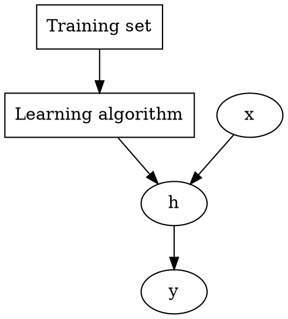

# Machine Learning

From [coursera](https://www.coursera.org/learn/machine-learning)


Started on Jan 29, 2017.

[toc]

## Intro

[toc]

### Examples:
- Database mining
- Application can't program by hand
	- autonomous helicopter, handwriting recognition, most natural language processing, computer vision
- Self-customizing programs


### Supervised learning

Concepts:
- Feature/Attribute

Two types of problem:
- Classification
- Regression

### Unsupervised learning

Not told the structure/feature/type. Automatically find the structure/pattern

E.g., clustering algorithm

Application:
- organize computer cluster
- social network analysis
- market segmentation
- astronomical data analysis

Cocktail party problem: two sound source, two microphone with different distances to the sound source, separate the two sound.

Quiz finished at 22:00, Jan 30, 2017.

## Model and Cost Function

Training set, notations: $m, x, y$

Hypothesis, Parameters, Cost function

## Test Graphviz
Code:

Result:

Some other bloody code:
```javascript
function highLight() {
	$(document).ready(function() {
		$('pre code').each(function(i, block) {
			hljs.highlightBlock(block);
		});
	});
}
```


