

```noteinfo
{
	"date": {
		"y": 23,
		"m": 2,
		"d": 2017
	},
	"tag": [""]
}
```

[back to top](#top)

## 2017 Spring


[toc]


### Ref links for superconducting qubits

```dot-parse
digraph G {
	graph[
		rankdir="LR";
		ranksep=3;
		bgcolor="black";];

	edge[color="white";fontcolor="white";];
	node[color="white";fontcolor="white";shape=rectangle];

	subgraph cluster_design {
		
		color = white;fontcolor="white";
		label="design";

		Majer2007[label="Majer2007, Coupling superconducting qubits via a cavity bus"]
		Koch2007[label="Koch2007, Charge-insensitive qubit design derived from the Cooper pair box"]
		Barends2013[label="Barends2013, Coherent Josephson Qubit Suitable for Scalable Quantum Integrated Circuits"]		
	}

	subgraph cluster_app {
		color = white;fontcolor="white";
		label="Application";
		
		DiCarlo2009[label="DiCarlo2009, Demonstration of two-qubit algorithms with a superconducting quantum processor"]
		DiCarlo2010[label="DiCarlo2010, Preparation and measurement of three-qubit entanglement in a superconducting circuit"]
		Chow2014[label="Chow2014, Implementing a strand of a scalable fault-tolerant quantum computing fabric"];

		Chow2012[label="Chow2012, Universal Quantum Gate Set Approaching Fault-Tolerant Thresholds with Superconducting Qubits"];

	}

	subgraph cluster_setup {
		color = white;fontcolor="white";
		label="Setup & fabrication";

		Barends2011[label="Barends2011, Minimizing quasiparticle generation from stray infrared light in superconducting quantum circuits"]
		Barends2010[label="Barends2010, Minimal resonator loss for circuit quantum electrodynamics"]
		Megrant2012[label="Megrant2012, Planar superconducting resonators with internal quality factors above one million"]
		Chen2014[label="Chen2014, Fabrication and characterization of aluminum airbridges for superconducting microwave circuits"]

	}

	subgraph cluster_simu {
		color = white;fontcolor="white";
		label="Theory & Simulation";

		Strauch2003[label="Strauch2003, Quantum Logic Gates for Coupled Superconducting Phase Qubits"]
		Martinis2005[label="Martinis2005, Decoherence in Josephson Qubits from Dielectric Loss"]
		Wenner2011[label="Wenner2011, Surface loss simulations of superconducting coplanar waveguide resonators"]

	}



	subgraph cluster_characterization {
		color = white;fontcolor="white";
		label="characterization";

		Houck2008[label="Houck2008, Controlling the Spontaneous Emission of a Superconducting Transmon Qubit"]
		Schreier2008[label="Schreier2008, Suppressing charge noise decoherence in superconducting charge qubits"]
		Gambetta2012[label="Gambetta2012, Characterization of Addressability by Simultaneous Randomized Benchmarking"];
		Magesan2011[label="Magesan2011, Scalable and Robust Randomized Benchmarking of Quantum Processes"]

	}


	subgraph cluster_control {
		color = white;fontcolor="white";
		label="control";


		Rigetti2010[label="Rigetti2010, Fully microwave-tunable universal gates in superconducting qubits with linear couplings and fixed transition frequencies"];
		Corcoles2011[label="Corcoles2011, Protecting superconducting qubits from radiation"]

	}


	subgraph cluster_readout {
		
		color = white;fontcolor="white";
		label="readout, tomography, signal & data processing";

		Schuster2005[label="Schuster2005, ac Stark shift and dephasing of a superconducting qubit strongly coupled to a cavity field"]
		Filipp2009[label="Filipp2009, Two-Qubit State Tomography Using a Joint Dispersive Readout"]
		Reed2010[label="Reed2010, High-Fidelity Readout in Circuit Quantum Electrodynamics Using the Jaynes-Cummings Nonlinearity"]
		Ryan2015[label="Ryan2015, Tomography via correlation of noisy measurement records"]
		Khalil2012[label="Khalil2012, An analysis method for asymmetric resonator transmission applied to superconducting devices"]

	}





	Chow2014->Gambetta2012[label="simutaneous randomized benchmarking for addressibility"]
	Chow2014->Magesan2011[label="Clifford randomized benchmarking for single-qubit gates"]
	Chow2014->Rigetti2010[label="ZX90 gates using the cross-resonance interaction"]
	Chow2014->Chow2012[label="SDP and raw state reconstruction for fidelity calculation"]
	Chow2014->Chow2012[label="gate calibration, quantum process tomography"]
	Chow2014->Ryan2015[label="readout & signal process"]
	Chow2014->Corcoles2011[label="two-qubit refocusing sequence for ZX90 gates"]


	Barends2013->Reed2010[label="dispersive, high-power single-shot readout scheme"]
	Barends2013->Barends2011[label="multi-stage infrared shielding"]
	Barends2013->Barends2010[label="T1's dependence on capacitor width"]
	Barends2013->Wenner2011[label="Loss simulation"]
	Barends2013->Chow2012[label="T1 vary between qubits even on the same chip"]
	Barends2013->Megrant2012[label="high Q resonator by MBE Al on oxygen-cleaned sapphire"]
	Barends2013->Martinis2005[label="TLS defects distribution"]

	DiCarlo2010->Schreier2008[label="transmon qubit"]
	DiCarlo2010->Houck2008[label="isolation from EM environment"]
	DiCarlo2010->Reed2010[label="readout"]
	DiCarlo2010->DiCarlo2009[label="C-Phase gate"]
	DiCarlo2010->Filipp2009[label="joint readout"]
	DiCarlo2010->Strauch2003[label="C-Phase gate"]

	DiCarlo2009->Filipp2009[label="joint dispersive readout"]
	DiCarlo2009->Majer2007[label="joint dispersive readout"]

	Schreier2008->Schuster2005[label="spectroscopy"]

}
```





### Fabrication and characterization of aluminum airbridges for superconducting microwave circuits

Chen, Z., et al. (2014). "Fabrication and characterization of aluminum airbridges for superconducting microwave circuits." Applied Physics Letters 104(5): 052602.

To avoid slotline modes. Additional loss at single photon levels is small and decreases at higher drive powers.


### Preparation and measurement of three-qubit entanglement in a superconducting circuit

DiCarlo, L., et al. (2010). "Preparation and measurement of three-qubit entanglement in a superconducting circuit." Nature 467(7315): 574-578.

#### parameters
- x & y rotations in 8ns
- spectrum free of spurious anti-crossings, critical requirement for pulsed qubit freq change
- T1 ~ 1 us, T2* ~ 0.5 us
- cavity linewidth $\kappa$=2.4MHz
- GHZ state fidelity 88%

#### Methods
- obtain flux-voltage relation including cross-talk and offsets. Cross-talk corrected by orthogonalization (inverting the relation matrix)
- expand three-qubit density matrix in Pauli operator basis
- use Mermin sums and Mermin products to characterize entanglement for all reative phase of the GHZ-like state
- not loop-hole free


#### Unclear & to read
- entanglement generation gates
- high fidelity joint readout


### Controlling the Spontaneous Emission of a Superconducting Transmon Qubit

Houck, A. A., et al. (2008). "Controlling the Spontaneous Emission of a Superconducting Transmon Qubit." Physical Review Letters 101(8): 080502.


#### Conclusion
- equations not explicitly shown, needs to be found in refs
- classical circuit model
- quantum model under development
- see Fig3 for main results and comparison with experiment
	- T1 depends on detuning, i.e., Purcell effect
	- give more accurate results comparing to single mode model
- qubit T1 depends on the position
- all T1 has an intrinsic limit on Q about 70000 


### Coherent Josephson Qubit Suitable for Scalable Quantum Integrated Circuits

Barends, R., et al. (2013). "Coherent Josephson Qubit Suitable for Scalable Quantum Integrated Circuits." Physical Review Letters 111(8): 080502.

Proposal and experimental article of Xmon.

#### Conclusion
- energy coherence time in excess of 40 us
- fast controlled Z gate in 25 ns
- decoherence mechanism: a sparse bath of weakly coupled defects, giving rise to freq-dependent variations in lifetime, make qubits on the same chi having different T1 time
- energy relaxation time increases with capacitance width, because loss depends on participation ratio

#### Parameters
- resonator Q ~ 1e6, MBE Al on oxygen-cleaned sapphire
- upper limit of T1 from XY control: 60aF, 0.3 ms, and from Z control: 2.2 pH, 30 ms
- Ramsey T2 = 15 us, spin echo T2 = 20 us
- single-shot readout fidelity 70~85%
- readout resonator 6.5 GHz, loaded Q = 1e4, g = 40 MHz

#### Setup
- multistage infrared shielding
- nonmagnetic MW connectors


#### Unclear & to read
- dispersive, high-power single-shot readout
- time-resolved spectroscopy (swap spectroscopy)
- read supplemental material about decoherence simulation


#### Supplementary materials
- junction age very little
- Z pulse shape measurement: vary $Z_{amp}$ and $\Delta Z$ and apply $X_{\pi}$ at the same time. Excite state occupation well described by truncated Gaussian. Conclusion: qubit frequency can be tuned on a timescale of nanoseconds.
- analytic results for loss from one TLS defect, using master equation with Markovian decoherence Lindblad terms:

<p>
$$
\Gamma_1 = \frac{2g^2 \Gamma }{\Gamma^2 + \Delta^2} + \Gamma_{1,Q}
$$
</p>

- Monte Carlo simulation of defects, randomly place defects inside 3nm thick interfaces, obtained spacial distribution of defects with large coupling, obtained $\Gamma_1$ versus frequency.


### Implementing a strand of a scalable fault-tolerant quantum computing fabric

Chow, J. M., et al. (2014). "Implementing a strand of a scalable fault-tolerant quantum computing fabric." Nat Commun 5: 4015.

#### Parameters

- T1: 24, 29, 20 us
- T2: 32, 25, 18 us
- $\chi/\pi$: -2.0, -2.0, -2.3 MHz
- readout resonator $\kappa/2\pi$: 443, 976, 793 kHz
- anharmoonicities ~ -340 MHz
- coupling strengths $g/2\pi$: 70, 67, 67 MHz

#### Unclear
- random benchmarking
- gate calibration
- readout and tomography 


### Scalable ion-photon quantum interface based on integrated diffractive mirrors

[npj quantum information](http://www.nature.com/articles/s41534-017-0006-6)


- microfabricated trap with integrated diffractive mirrors
- couples 4% fluorescence, three times better
- overcomes mode quality limitations of existing integrated optical interconnects

trapped ion:

- coherence time approaching 1min
- qubit gate error rate below $10^{-4}$
- fluorescence:
	1. state readout
	2. create remote entanglement
	- both of which only depend on the fluorescence collection efficiency


Result

- deposite Al on etched substrate
- multi-zone micro-fabricated surface trap with integrated diffractive mirrors


### A scanning transmon qubit for strong coupling circuit quantum electrodynamics

[Nat. Comm.](http://www.nature.com/articles/ncomms2991)


- Scanning transmon qubit. i.e., the transmon fabricated on a $4\times 4 mm^2$ sapphire chip, then glued to a tip of a highlt conductive copper rod on a cryogenic positioning stage, CPW resonators on chip on sample stage. Transmon scanned across the resonator so that coupling vs space can be obtained.


- Spacial distribution of $g$ agrees with simulation.


- A typical movement of the positioning stage of 10um heated the refrigerator from its base temperature of 15mK to over 85mK. Most measurement done between 25 to 35mK


- $T_1, T_2^* \sim 1\mu s$.


- Coulping strength adopted from (this great paper also has a lot information on estimating $T_1$ and $T_2$): `Koch, J. et al. Charge-insensitive qubit design derived from the Cooper pair box. Phys. Rev. A 76, 042319 (2007).`


### Prospective two orders of magnitude enhancement in direct magnetic coupling of a single-atom spin to a circuit resonator


- arXiv:1702.02210v1
- $ g/2\pi = 0.24 $MHz
- spiral geometry (insert figure here)
- $ I_{ac} = \sqrt{( \bar n +1/2 ) \hbar \omega/L_{tot}} $, $ L_{tot} = L_g + L_p $ (geometry inductance + parasite inductance)
- $ L_g \propto N_{loops}^2 \log(N_{loops}) $
- $ g \propto I_{ac} \log(N_{loops}) $
- $L_p$ depends weaker on $ N_{loops} $, hence $g$ increase up to a point where $L_g$ approaches $ L_p$ then $I_{ac}$ begins to drop as $N^\alpha$ with $\alpha < -1$
- dependence of $L_{tot}, J, g/2\pi, Q$ versus $N_{loops}$ from simulation (insert figure)

#### Resulting parameters
- $ g/2\pi = 0.24 $MHz
- $Q \sim 10^4$
- spin initialization $T_{1,init}=2.3\mu s$
- rotation speed $f = 29$MHz, corresponded $ N_{\pi} > 10^5 $


#### Related
- the absence of tunneling states
in a hydrogen-free amorphous silicon film suggesting the
possibility of depositing "perfect" silicon: [Hydrogen-Free Amorphous Silicon with No Tunneling States](http://journals.aps.org/prl/abstract/10.1103/PhysRevLett.113.025503)
- Appendix A of `Koch, J. et al. Charge-insensitive qubit design derived from the Cooper pair box. Phys. Rev. A 76, 042319 (2007)` includes details of network analysis about estimation of capacitances


### Scalable quantum circuit and control for a superconducting surface code


- arXiv:1612.08208v1
- A scalable scheme for executing error-correction cycle of a monolithic surface code
- fast-flux-tunable transmon qubit
- nearest neighbor coupling (flux controlled CZ in this paper)
- eight qubit unit cell realizing quantum hardware and coherent control

#### Intro
- surface code is better than Stean and Shor code concerning hardware requirement
- error rate of qubit gate: single: <0.1%; two-qubit CZ: ~1%
- scalability
	- copy-paste unit cell
	- quantum interconnect between cells in the quantum plane
	- classical control to and from the control plane (already many pursues, see article)
	- crucial to extend the unit cell to control plane to have real scalability (demonstrated in this paper)
	- frequency multiplexing is already heavily exploit in cQED systems, spatial multiplexing is still in its infancy


In this paper:
- flux-controlled CZ gate
- three fixed freq for single-qubit control
- eight detuning sequences for two-qubit gates

#### Background

Surface code QEC
- circuit depth: \# of operations on each ancilla per QEC cycle
- $ \tau_{1Q}=20 $ns, $\tau_{2Q}=40$ns, 500ns for ancilla readout and photon depletion in readout resonator, total 740ns for QEC cycle


Limitations
- fully paralellized X and Z type stabilizer measurements with CZ gate not realized yet
- the CZ gate mentioned above is expected to satisfy:
	- single-qubit gate MW pulse at a fixed small \# of frequencies
	- transmons maximally exploit coherence sweetspot
	- transmons do not cross other interaction zones on their way to/from the intended anti-crossings for the CZ gate
	- flux-pulsing schemes should be scalable with fixed number of detuning sequences and fixed range
	- implementation be compatible with logical qubit operations


First three realized. No fully parallel solution exists with a fixed number
of detuning sequences and a fixed detuning range.

#### The pipelined QEC cycle

#### Questions and unknowns
- Read the surface code paper! (Phys. Rev. A 86, 032324 (2012).)
- microwave-frequency vector switch matrix (VSM)
- Pauli frame updating (PFU)


