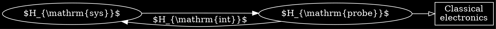

```noteinfo
{
	"date": {
		"y": 31,
		"m": 1,
		"d": 2017
	},
	"tag": ["research","thesis"]
}
```

## Quantum Trajectories of a Superconducting Qubit

Jan 31, 2017

The experiments discussed in this thesis use superconducting circuits to study the process
of measurement of a quantum system.

These are the first experiments to successfully track diffusive
quantum trajectories in a solid state system. Furthermore, these are the first experiments
on any system to use quantum state tomography at discrete times along the trajectory
to verify that we have faithfully tracked the qubit state.

[toc]

### Parameters, acronyms and concepts

- measurement quantum efficiency $\eta$
- HEMT: high electron mobility transistors, usually at 4K, can only achieve $ \eta\sim 1$
- QND: quantum non-demolition measurement: cases no backaction on the measured observable beyond the usual backaction associated with the acquisition of information
- Heisenberg backaction: the act of acquiring information about one observable will necessarily perturb its canonically conjugate observable
- standard quantum limit
- POVM: positive operator-valued measures
- SME: stochastic master equations
- SSE: stochastic schrodinger equations

### Continuous quantum measurement

[toc]

Example of non-QND measurement: measure $x$ of a HO: $\psi (x)\propto \mathrm{exp}[-m \omega x^2/2\hbar] $. $\Delta p$ increase after the measurement and the time evolution of $x$ is perturbed.

Indirect measurement:


An indirect measurement will be QND, provided that the probe is not affected by more
than one of any set of non-commuting observables of the measured system.

#### Formal criteria for QND measurement

QND iff $$[q,U]=0,$$ where $q$ is the general coordinate to measure and $U$ is the unitary operator that generates joint evolution of the measured system and
the probe over the full measurement time.

In practice, $U$ is hard to calc, hence use a more restrictive sufficient condition:
$$
[q,H]=0
$$
assuming no explicit time dependent of the operator $q$. By definition, $[q,H_{\mathrm{probe}}]=0$. If $q$ is conserved during the evolution of the measured system, $ [q, H_{\mathrm{sys}} ] =0$, thus the requirement is
$$
[q, H_{\mathrm{int}} ]=0
$$


#### Partial and projective measurement

SNR, or strength, of a measurement: $$ S \equiv (\frac{\Delta V}{\sigma})^2 = \frac{4T}{\tau} $$

A partial measurement occurs when $ T \lesssim \tau $, a projective measurement: $ T \gg \tau $. Measurement rate: $ \Gamma_{\mathrm{meas}} =1/\tau $

$
\def\bra#1{\left< #1 \right|}
\def\ket#1{\left| #1 \right>}
\def\braket#1{ \left< #1 \right> }
$

Single shot measurement fidelity $F = 1 - P(1|q_{\ket{0}}) - P(0|q_{\ket{1}}) $

Separation fidelity $ F_s  $ sets an upper bound on $F$. Reason reducing $F$: 
- qubit energy relaxation
- measurement is not entirely QND hence inducing transition

The quantum efficiency
of a measurement describes how close it comes to ideal Heisenberg-limited backaction:
$$
\eta_m \equiv \frac{\Gamma_m}{\Gamma_{m,\mathrm{ideal}}}
$$

For qubit system, $\Gamma_m\propto\S/S_{ \mathrm{ideal}}$, which is related to $ \Delta V $ and $ \sigma $:
$$
\eta_m = \left (\frac{\Delta V}{\Delta V_{\mathrm{ideal}}} \right )^2 \left (\frac{\sigma}{\sigma_{\mathrm{ideal}}} \right )^2 = \eta_{col}\eta_{amp}
$$
Additional dephasing from environment (qubit's) is described by $\eta_{env} $, hence total efficiency $\eta = \eta_m \eta_{env} $

POVM: a more general set of measurement operators $ \{\Omega_m\} $ satisfying $ \sum_m \Omega_m^\dagger \Omega_m = I $. The $m$-th result occurs with $P(m) = \mathrm{Tr}[\Omega_m \rho \Omega_m^\dagger] $ and the state
$$
\rho_f = \frac{\Omega_m \rho \Omega_m^\dagger}{\mathrm{Tr}[\Omega_m \rho \Omega_m^\dagger]}
$$
Index $m$ can be generalized to be continuous and in the qubit case,
$$
\Omega_V = \frac{1}{\mathcal N}[ e^{-2k\eta_m \Delta t(1-V)^2} \ket 0 \bra 0 + e^{-2k\eta_m \Delta t(-1-V)^2} \ket 1 \bra 1 ]
$$
where $ \mathcal N $ is for normalization and $ k \eta_m \equiv 1/4\tau $ parametrizes the measurement strength (with measurement operator $ \sqrt{k} \sigma_z $). $V$ is rescaled.

Hence the probability for each measurement result:
$$
P( \Omega_V ) = \mathrm{Tr} (\Omega_V \rho \Omega_V^\dagger ) = P(\ket{0}) e^{ -4 k \eta_m \Delta t(1-V)^2 } +P(\ket{1}) e^{ -4 k \eta_m \Delta t(-1-V)^2 }
$$


#### Quantum trajectories

If we understand the backaction of an individual measurement, then this understanding can be used to update our knowledge of the quantum state after (and during)
measurement. This is essential
to applications in measurement-based quantum feedback and control.

Consider a continuous QND measurement of a qubit, the signal $ V(t) $ is broken up to discrete time steps of width $ \Delta t $ and recorded as $ [ V_0, V_1,...,V_{n-1} ] $, where
$$
V_i = \frac{1}{\Delta t} \int^{t_i +\Delta t}_{t_i}V(t)dt
$$

- quantum jumps are most readily observed when $ \tau \lesssim \Delta t< \tau_{\mathrm{jump}} < T $
- diffusive trajectories are most readily observed when $ \Delta t \ll \tau < T < \tau_{\mathrm{jump}} $


##### Stochastic master equations

For weak measurement $ \Delta t \ll \tau $, the distribution of single measurement reduce to
$$
P(\Omega_{V_i})\approx e^{ -4k \eta_m \Delta t (V_i - \braket{\sigma_z} )^2 }
$$
which shows that $V_i$ can be thought as simply a noisy estimate of $\braket{\sigma_z}$: $ V_i = \braket{\sigma_z} + \frac{\Delta W}{\sqrt{8k\eta_m}\Delta t} $

Similarly, $ \Omega_{V_i} $ can also be re-expressed as $ \Omega_{V_i} \propto e^{-2k\eta_m \Delta t (V_i - \sigma_z)^2} $, in addition with $ \ket{ \psi (t+\Delta t) }\propto \Omega_{V_i} \ket{\psi(t)} $, keeping to first order in $ \Delta t $ and after normalization, we get SSE:
$$
d \ket{\psi} = \lbrace -k(\sigma_z - \braket{ \sigma_z })^2 dt + \sqrt{2k} ( \sigma_z - \braket{ \sigma_z })dW \rbrace \ket{\psi(t)}
$$
and SME:
$$
d\rho = -k [ \sigma_z, [\sigma_z , \rho ] ] dt + \sqrt{2k \eta} ( \sigma_z \rho + \rho \sigma_z - 2 \braket{\sigma_z} \rho )dW
$$

##### Bayesian state update:

$$
\frac{\rho_{11}(t)}{\rho_{00}(t)} = \frac{P(1|V_m)}{P(0|V_m)} = \frac{P(1)}{P(0)} \frac{P(V_m|1)}{P(V_m|0)} = \frac{ \rho_{11}(0) }{\rho_{00}(0)} \frac{ \exp [ -( V_m(t) + \Delta V/2 )^2/2 \sigma^2 ] }{\exp [ -( V_m(t) -\Delta V/2)^2 /2 \sigma^2 ]}
$$

### Experimental setup

- Qubit: 3D transmon, $ T_1 = 30 \mu s \sim 100 \mu s $
- bias up the paramp: single pump, double pump, flux-pumping; balance the two sidebands isn't trivial
- displace the signal before paramp


